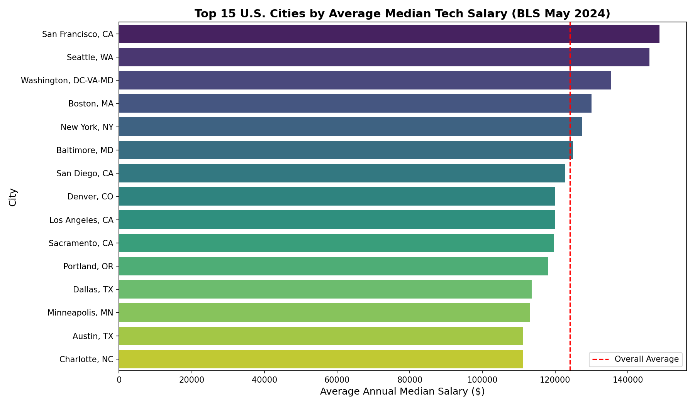
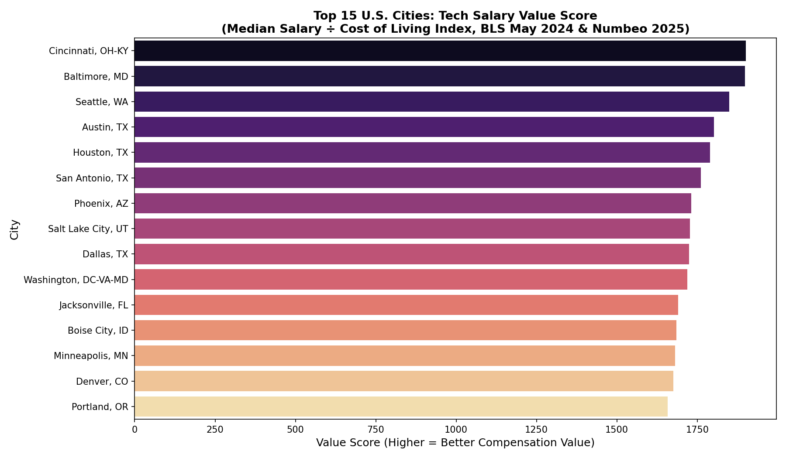

# US Tech Workforce Compensation Analysis (2024)

**Data Wrangling & Analysis | Python, Pandas**

An end-to-end data wrangling and analysis project examining tech occupation salaries across U.S. metro areas and their relationship to cost of living.

## Research Question

This project investigates how tech occupation salaries vary across U.S. metropolitan areas and how those salaries relate to local cost of living. Understanding this relationship is critical for both employers making location-based hiring decisions and professionals evaluating where to maximize their earning power. The combined dataset makes it possible to identify which cities offer the best compensation *value* for tech workers, not just the highest raw pay.

**Full analysis notebook:** [tech_workforce_compensation_analysis.ipynb](./tech_workforce_compensation_analysis.ipynb)

## Data Sources

- **BLS OEWS May 2024** — U.S. Bureau of Labor Statistics Occupational Employment & Wage Statistics. Occupational employment and wage estimates for ~530 U.S. metro areas (occupation title, annual median wage, metro area, total employment).
- **Numbeo 2025** — Cost of Living Index by U.S. City, gathered via web scraping (BeautifulSoup). Includes cost of living index, rent index, and local purchasing power index per city.

## Tools & Libraries

Python, Pandas, NumPy, Matplotlib, Seaborn, BeautifulSoup, Requests

## Visualizations

### 1. Which U.S. cities pay tech workers the most?

The 15 U.S. metro areas with the highest average median tech salary (BLS May 2024), with the dashed red line marking the overall average across all cities. Seattle and San Francisco lead by a wide margin on raw pay.

### 2. Which cities give tech workers the best value for their salary?

Raw salary alone doesn't account for how far that money actually goes. This chart ranks cities by a **Value Score** — average median tech salary divided by the Numbeo cost of living index — so a higher score means better real purchasing power, not just a bigger paycheck. Ranking by value surfaces a very different set of cities than ranking by salary alone: Cincinnati, Baltimore, and Austin move to the top, and Texas cities consistently place in the top 10.

## Key Findings

- Seattle and San Francisco offer the highest raw tech salaries.
- Cincinnati, Baltimore, and Austin offer the best salary-to-cost-of-living value.
- Texas cities consistently rank in the top 10 for compensation value.
- The city that pays the most is not necessarily the city where that pay goes the furthest — raw salary and cost-adjusted value rankings diverge significantly.
